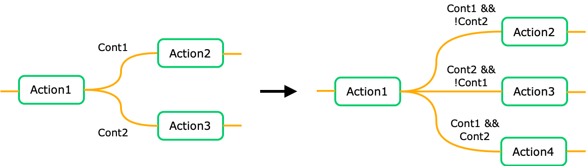

# ALLI/O IDE Supplementary Material

This repository contains supplementary material for the paper titled "ALLI/O IDE: Portable Embedded Programming via Action-based Diagram and Automatic Code Generation". 

## Table of Contents

### IDE and Device Libray

ALLI/O IDE is open-source and can be found at [link](https://anonymous.4open.science/r/ALLIO_Code). ALLI/O Device Library is open-source and can be found at [link](https://anonymous.4open.science/r/ALLIO_Libary).

### Design Examples

- [Automatic Night Light v1](night_light_v1/README.md) (ALLI/O, Arduino)
- [Automatic Night Light v2](night_light_v2/README.md) (ALLI/O, Arduino)
- [Windshield Wiper](windshield_wipers/README.md) (ALLI/O, Arduino, Ardublockly, MakeCode, SinelaboreRT, Visuino, XOD)
- [Scoreboard](score_board/README.md) (ALLI/O, Arduino)
- [Whack-A-Mole Game](whack_a_mole/README.md) (ALLI/O, Arduino)

### Microbenchmarks 

- [Counter](counter/README.md) (Sec. VIII-B)
- [Latency](latency/README.md)

## FAQ

1. What if multiple transitions become valid simultaneously?

    ALLI/O Diagram language specification doesn't specify which path of the diagram to proceed when both transitions are valid simultaneously. Therefore, the behavior will depend on specific code generation implementation. The rationale is that if both transitions are valid simultaneously, proceeding to any path of the graph is valid.

    In most cases this behavior is acceptable; however, if the developer wants the system to react differently when both Transitions are valid, he/she can add another Transition, e.g., Cont1, Cont2 => Cont1 && !Cont2, Cont2 && !Cont1, Cont1 && Cont2.

    

2. How to implement efficient non-blocking device shim?

    **Minimum Example**

    All device shims are a class that include at least three methods: init, update, and printStatus. Followed by method for all Actions, Conditions and Values supported by the device. In all cases, sensor values should be read in the update method and cached in an instance variable. The get...() method can be called many times during executing the Command or Transition block. Therefore, it should return a value cache in an instance variable to avoid blocking the execution thread.

    ```C++
    int MP_SOMEDEVICE::init() {
        // any necessary initialize code
        return MP_ERR_OK;
    }

    void MP_SOMEDEVICE::update(unsigned long current_time) {
        this->someValue = device.read();
    }

    void MP_SOMEDEVICE::printStatus() { /* ... */ }

    float MP_SOMEDEVICE::getSomeValue() { return this->someValue; }
    ```

    **Control acquisition rate**

    The update method receives the current time as a parameter, which can be used to limit the sensor reading rate. The following code shows how to read a sensor approximately every 50 ms.

    ```C++
    void MP_SOMEDEVICE::update(unsigned long current_time) {
        if (current_time - last_update >= 50) {
            this->someValue = device.read();
            last_update = current_time;
        }
    }
    ```

    **Handle device with long wait time**

    Long-running tasks and polling wait loops, as shown in the following code, should be avoided to prevent blocking the MCU from performing other tasks.

    ```C++
    // DO NOT DO THIS!!!
    void MP_SOMEDEVICE::update(unsigned long current_time) {
        device.begin_read();
        delay(50);
        this->someValue = device.getValue();
    }
    ```

    ```C++
    // DO NOT DO THIS!!!
    void MP_SOMEDEVICE::update(unsigned long current_time) {
        while (!device.is_ready());
        this->someValue = device.getValue();
    }
    ```

    Instead, split the task to be executed across multiple calls to the update method and use state machine or flag variables as necessary, as shown in the following examples.

    ```C++
    void MP_SOMEDEVICE::update(unsigned long current_time) {
        if (!hasBeginRead) { 
            device.begin_read();
            start_wait_time = current_time;
            hasBeginRead = true;
        } else if (hasBeginRead && (start_wait_time - current_time > 50)) {
            this->someValue = device.getValue();
            hasBeginRead = false;
        }
    }
    ```

    ```C++
    void MP_SOMEDEVICE::update(unsigned long current_time) {
        if (device.is_ready()) {
            this->someValue = device.getValue();
        }
    }
    ```

    For more example, please see our shim for a [push button](https://anonymous.4open.science/r/ALLIO_Libary/lib/arduino/MP_BUTTON_AL/MP_BUTTON_AL.cpp) which implements 30 ms debounce logic in software with a state machine to avoid blocking the MCU.
