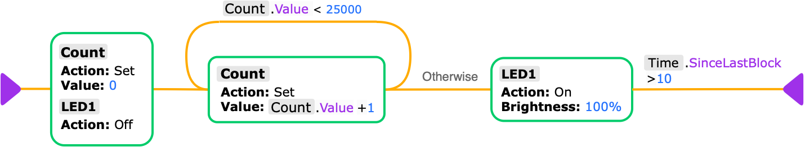

# Counter

A simple benchmark program which counts from 0 to 25,000 in a tight loop on each platform to measure execution speed.

## Implementations

1. [Native (Arduino)](arduino/README.md)
2. [ALLI/O](allio/README.md)

