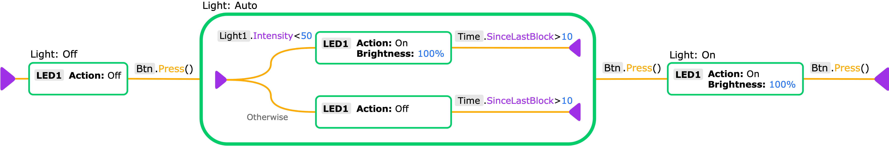
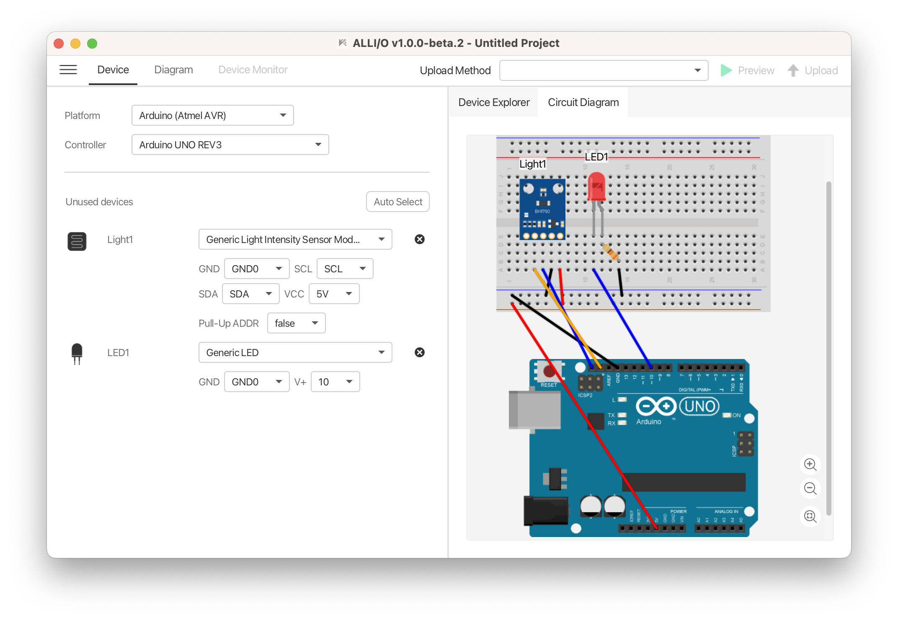
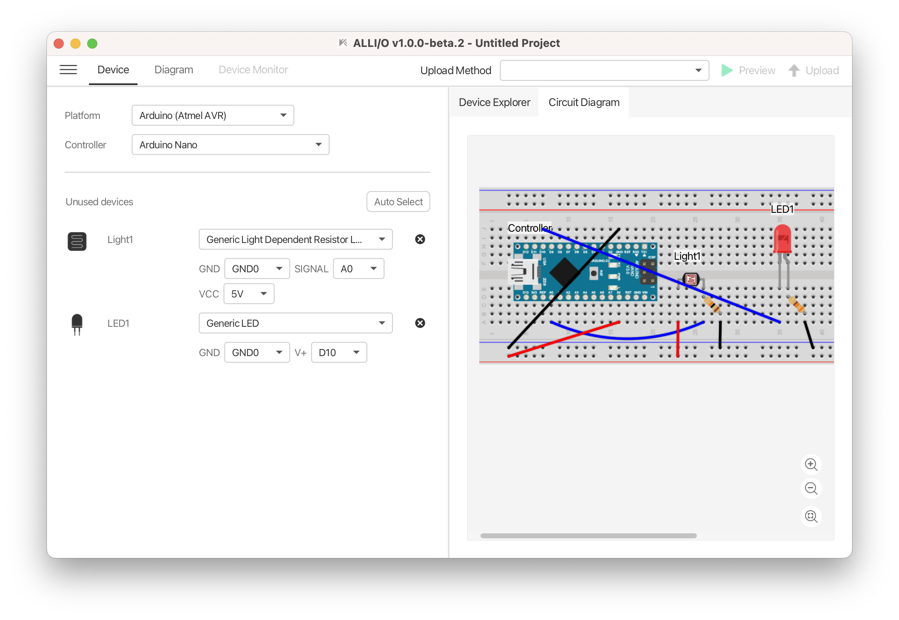
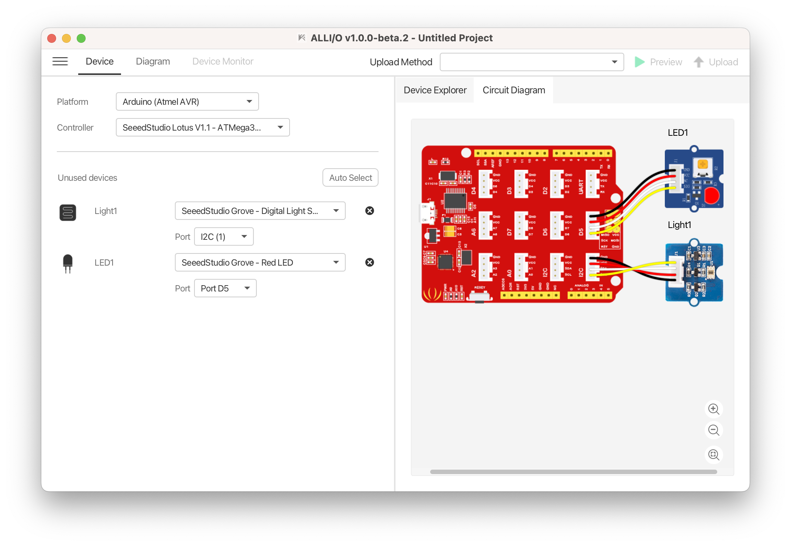

# Night Light V2 (ALLI/O)

An automatic night light system with a push button to toggle between three modes of operation: off, auto (based on ambient light), and on.

## ALLI/O Diagram

View/Download full diagram image in [png](diagram/night_light_v2.png) or [svg](diagram/night_light_v2.svg).



## Circuit Connection Diagram

The following table shows some possible devices combination (MCU, LED and light sensor) that can be programmed using the diagram above.

| List of Devices  | Connection Type | Screenshot |
| ---------------- | --------- |------------- |
| - Arduino UNO R3<br>- LED 5mm<br>- Rohm BH1750 Ambient Light Sensor (GY-302) | - Digital<br>- I2C | <br>([View full image](circuit/config1.png))  |
| - Arduino Nano<br>- LED 5mm<br>- Photoresistor (LDR) 5mm | - Digital<br>- Analog | <br>([View full image](circuit/config2.png))  |
| - Seeeduino Lotus v1.1<br>- Grove LED<br>- Grove Digital Light Sensor (TSL2561) | - Digital<br>- I2C | <br>([View full image](circuit/config3.png))  |

## Prerequisite

### Using command line

1. Python 3.6+ or above
2. PlatformIO Core ([link](https://docs.platformio.org/en/latest/core/installation/index.html))

### Using IDE

1. Visual Studio Code ([link](https://code.visualstudio.com))
1. PlatformIO IDE extension ([link](https://platformio.org/platformio-ide))

## Build Instruction

### Using command line

```Shell
cd <code_dir>
pio run --target upload
```

### Using IDE

1. Open the code directory with PlatformIO IDE
1. Press the "Build" button on the PlatformIO Toolbar. (See the [link](https://docs.platformio.org/en/latest/integration/ide/vscode.html#quick-start) for detailed instructions on how to use the PlatformIO IDE.)

