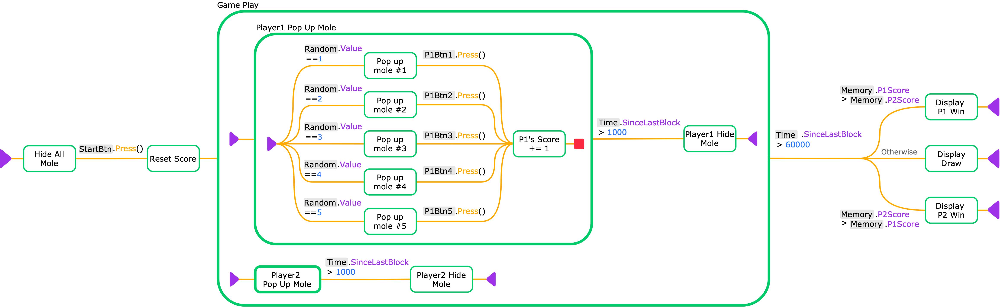
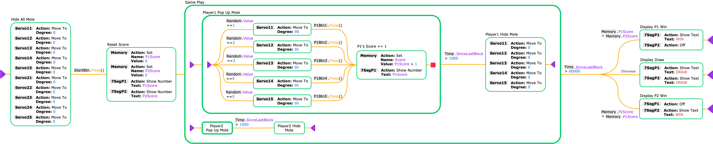

# Whack-A-Mole (ALLI/O)

## ALLI/O Diagram

View/Download overview diagram image in [png](diagram/whack_a_mole_small.png) or [svg](diagram/whack_a_mole_small.svg).



View/Download full diagram image in [png](diagram/whack_a_mole_large.png) or [svg](diagram/whack_a_mole_large.svg).



## Prerequisite

### Using command line

1. Python 3.6+ or above
2. PlatformIO Core ([link](https://docs.platformio.org/en/latest/core/installation/index.html))

### Using IDE

1. Visual Studio Code ([link](https://code.visualstudio.com))
1. PlatformIO IDE extension ([link](https://platformio.org/platformio-ide))

## Build Instruction

### Using command line

```Shell
cd <code_dir>
pio run --target upload
```

### Using IDE

1. Open the code directory with PlatformIO IDE
1. Press the "Build" button on the PlatformIO Toolbar. (See the [link](https://docs.platformio.org/en/latest/integration/ide/vscode.html#quick-start) for detailed instructions on how to use the PlatformIO IDE.)

